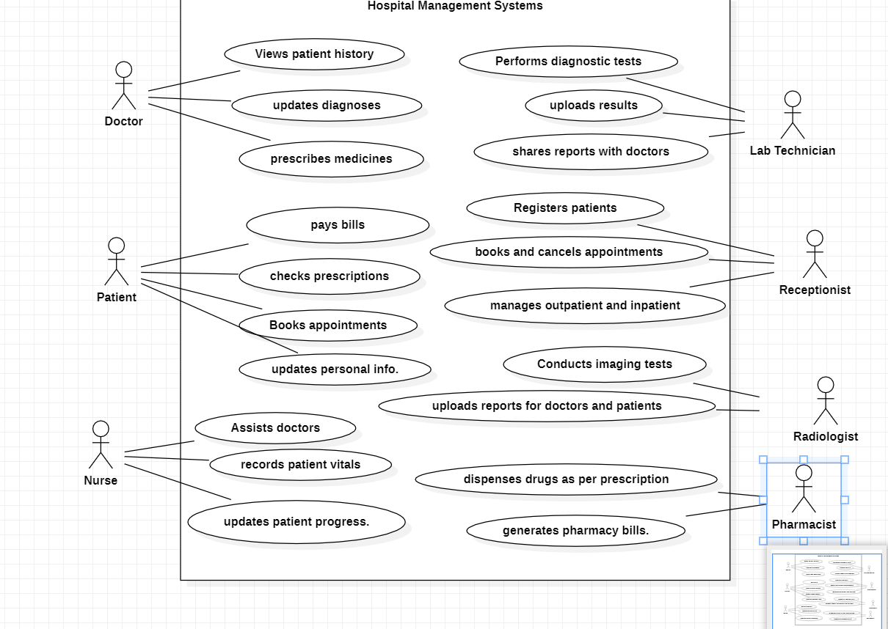
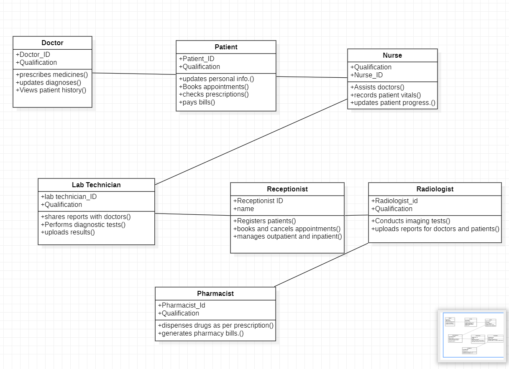
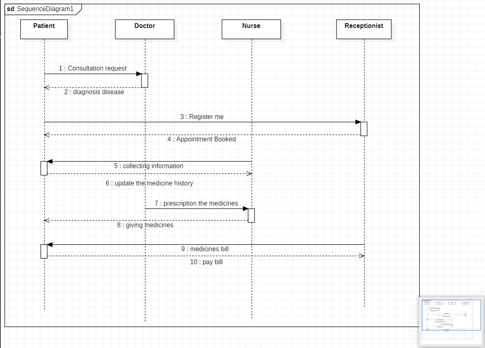
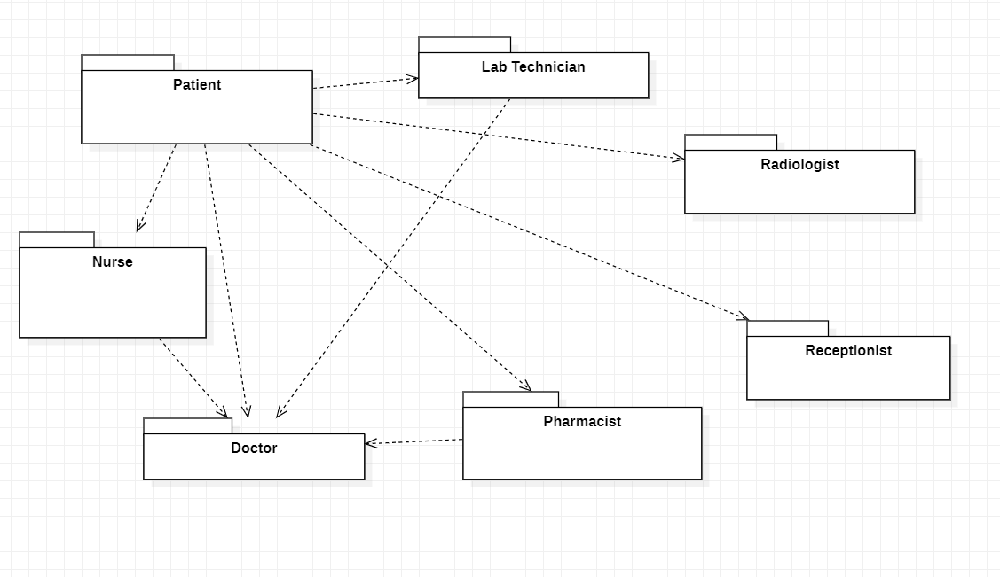
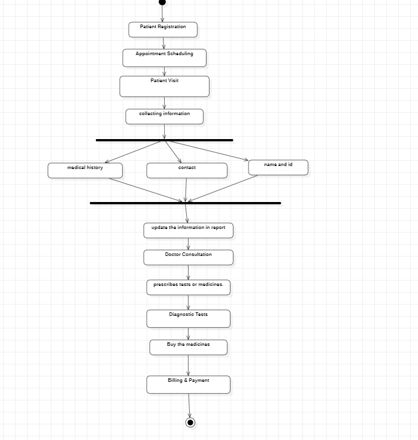
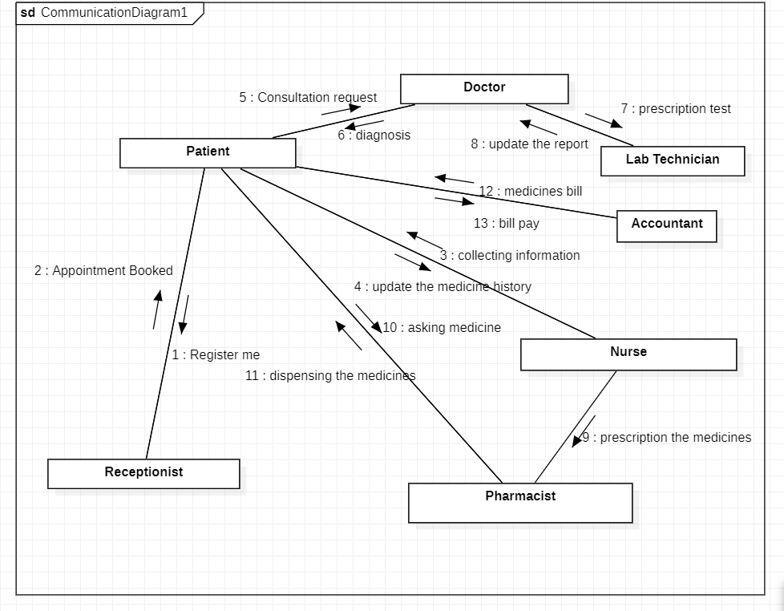

# Exp - 4 HOSPITAL MANAGEMENT SYSTEM

# AIM:
To draw the UML diagram for Hospital Management System.
# SRS (Procedure):
List of Programs:

i) Usecase Diagram

ii)Class Diagram

iii)Activity Diagram

iv)Communication Diagram

v)Package Diagram

vi)Sequence Diagram

# DIAGRAMS:
(upload all 6 diagrams)

# Use Case Diagram

# Class Diagram

# Sequence Diagram

# package diagram

# Activity Diagram

# communication diagram

# RESUlt:

Thus the program is verified succeccfully.
